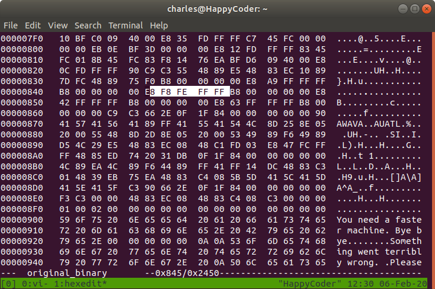

# CTF Name – [be-quick-or-be-dead-1](https://2018game.picoctf.com/problems)

* **Category:** Reversing
* **Points:** 200 points

## Challenge

> Can you run it fast enough?

## Solution
The program does not output flag saying the machine is not fast enough. There must be some code making unnecessary delay. 

Look into the binary using Ghidra. 
```c
undefined8 main(void)

{
  header();
  set_timer();
  get_key();
  print_flag();
  return 0;
}
```
Obviously, set_timer() is the one that prevents the flag to be printed. We can simply modify the binary and replace the call with [NOP](https://c9x.me/x86/html/file_module_x86_id_217.html) which does nothing. The NOP opcode is 0x90.

Here is the disassembled code for the relevant code.
```c-objdump

        00400836 b8 00 00        MOV        EAX, 0x0
        0040083b e8 a9 ff        CALL       header                                           ; undefined header(void)
        00400840 b8 00 00        MOV        EAX, 0x0
        00400845 e8 f8 fe        CALL       set_timer                                        ; undefined set_timer(void)
        0040084a b8 00 00        MOV        EAX, 0x0
        0040084f e8 42 ff        CALL       get_key                                          ; undefined get_key(void)
        00400854 b8 00 00        MOV        EAX, 0x0
        00400859 e8 63 ff        CALL       print_flag                                       ; undefined print_flag(void)
        0040085e b8 00 00        MOV        EAX, 0x0
```
We just need to fill the bytes form 845 to 849 with 0x90. 



Then run the modified binary, the flag would be out.


The flag: 
<!--  picoCTF{why_bother_doing_unnecessary_computation_27f28e71} -->
